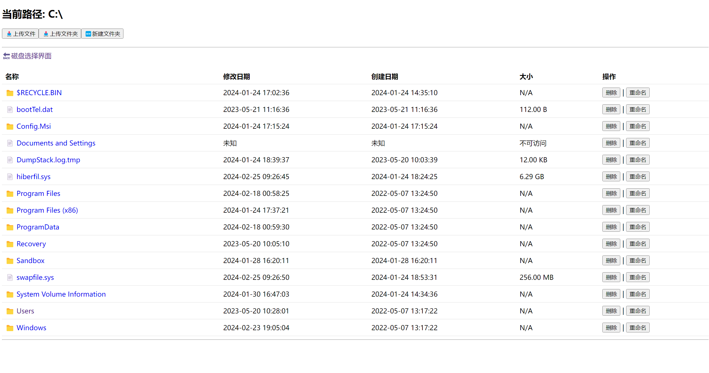
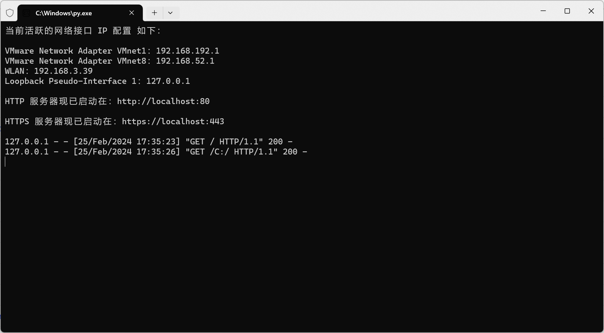

# HttpsFileServer 使用说明

HttpsFileServer 是一个使用 Python 编写的多功能 HTTP/HTTPS 文件服务器，旨在提供文件的上传、下载、管理等服务，同时支持基本认证和 SSL 加密传输，确保数据传输的安全性。

## 🚀 功能介绍

- 📤 **文件（夹）上传**：支持通过浏览器上传单个文件或整个文件夹。
- 📥 **文件下载**：允许下载服务器上的单个文件。
- 🗑️ **文件（夹）删除**：可以从服务器上删除不再需要的文件或文件夹。
- ✏️ **文件（夹）重命名/复制/移动**：简单操作即可重命名或复制移动文件（夹）。
- 📋 **新建文件夹**：实现新建文件夹，支持输入的内容包含路径分隔符（如 "new\subcatalog"），以创建相应的嵌套目录结构。
- 💾 **磁盘选择**：支持查看各种盘符下的文件。
- 🗂️ **目录浏览**：提供网页界面，方便浏览和管理服务器文件系统。
- ⏸️ **断点续传**：支持文件的断点续传功能。
- 🔑 **基本认证**：可设置用户名和密码，对服务器资源进行保护。
- 🔒 **HTTPS 支持**：支持 SSL 加密，保障数据传输安全。

### 🛠️ 重命名、复制和移动功能详解

HttpsFileServer 提供了灵活的文件操作功能，包括重命名、复制和移动文件或文件夹。以下是各功能的详细介绍和使用方法：

#### 📋 复制操作（包含在重命名功能里面）

- **判据**：用户输入的字符串以 "`copy:`" 开头（忽略大小写）。
- **特性**：操作会保留所有文件的元数据。
- **⚠️注意**：目标路径必须包含新文件名；如果目标路径存在与自身相同的项目会进行覆盖操作，如果这不是您的预期行为，请勿使用此功能！

##### 处理过程：

1. 把除了"`copy:`"之外的部分去除首尾空格，作为用户的目标路径
2. 如果源路径和新路径相同，那么提示：'`复制失败：不能将文件（夹）复制到自己的路径。`'
3. 如果正在操作的是文件夹，复制到目标位置，如果复制前目标位置已存在相同名称的文件夹，先删除再复制
4. 如果正在操作的是文件，复制到目标位置（如果已存在则覆盖）

##### 语法示例：

   以正在操作 `C:\Users\admin\Desktop\test.txt` 为例，输入：

- `copy: \subcatalog\新名称.txt`：`复制成功："C:\Users\admin\Desktop\test.txt" 到 "C:\subcatalog\新名称.txt"。`
- `copy: subcatalog\新名称.txt`：`复制成功："C:\Users\admin\Desktop\test.txt" 到 "C:\Users\admin\Desktop\subcatalog\新名称.txt"。`
- `copy: test.txt`：`复制失败：不能将文件（夹）复制到自己的路径。`
- `copy: D:\subcatalog\新名称.txt`：`复制成功："C:\Users\admin\Desktop\test.txt" 到 "D:\subcatalog\新名称.txt"。`
- `copy: \新名称.txt`：`复制成功："C:\Users\admin\Desktop\test.txt" 到 "C:\新名称.txt"。`

---

#### 🚚 移动操作（包含在重命名功能里面）

- **判据**：用户输入的字符串不以 "`copy:`" 开头（忽略大小写），但包含路径分隔符。
- **⚠️注意**：目标路径必须包含新文件名；如果目标路径存在与自身相同的项目会进行覆盖操作，如果这不是您的预期行为，请勿使用此功能！

##### 处理过程：

1. 如果源路径和新路径相同，则提示：'`移动失败：不能将文件（夹）移动到自己的路径。`'
2. 如果正在操作的是文件夹，移动到目标位置。如果移动前目标位置已存在相同名称的文件夹，先删除再移动。
3. 如果正在操作的是文件，移动到目标位置（如果已存在则覆盖）。

##### 语法示例：

   以正在操作 `C:\Users\admin\Desktop\test.txt` 为例，输入：

- `\subcatalog\新名称.txt`：`移动成功："C:\Users\admin\Desktop\test.txt" 到 "C:\subcatalog\新名称.txt"。`
- `subcatalog\新名称.txt`：`移动成功："C:\Users\admin\Desktop\test.txt" 到 "C:\Users\admin\Desktop\subcatalog\新名称.txt"。`
- `test.txt`：`移动失败：不能将文件（夹）移动到自己的路径。`
- `D:\subcatalog\新名称.txt`：`移动成功："C:\Users\admin\Desktop\test.txt" 到 "D:\subcatalog\新名称.txt"。`
- `\新名称.txt`：`移动成功："C:\Users\admin\Desktop\test.txt" 到 "C:\新名称.txt"。`

---

#### ✏️ 重命名操作

- **判据**：用户输入的字符串不以 "`copy:`" 开头（忽略大小写），且不包含路径分隔符。
- **操作**：更改文件或文件夹的名称而不改变其位置。

##### 语法示例：

   以正在操作 `C:\Users\admin\Desktop\test.txt` 为例，输入：

- `新名称.txt`：`重命名成功："C:\Users\admin\Desktop\test.txt" 到 "C:\Users\admin\Desktop\新名称.txt"。`

## 🛠️ 环境要求

- Python 3.x 环境
- 必要的 Python 库

## 🔧 使用前准备

1. 确保已安装 Python 3.x。（本程序在 Python 3.11.1 下编译）
2. （重要）将 SSL 证书文件 `cert.pem` 和私钥文件 `key.pem` 放置于程序同一目录下。可通过以下命令生成这两个文件：
   ```
   openssl req -x509 -newkey rsa:4096 -keyout key.pem -out cert.pem -days 365 -nodes
   ```
3. 安装 相关第三方库（如未安装）

## 📝 使用提示（必读！！！）

- 🚫 **关于使用 IDLE SHELL**：请注意，您可能无法在 Python IDLE Shell 中正常运行本程序。IDLE Shell 在处理多线程和网络服务方面存在一些限制，可能会导致程序无法正常工作。如果您已经使用 Python IDLE Shell 运行，在关闭窗口后，⚠️您还需要结束 `pythonw.exe`进程，然后使用下列方法才能正常使用！
- ✅ **推荐的使用方式**：建议使用其他代码编辑器或 IDE，例如 Visual Studio Code、PyCharm 等，来运行本程序。这些环境提供了更好的支持和更丰富的功能，能够确保程序的正常运行。
- 🛠️ **命令行运行**：您可以通过命令行界面（如 Windows 的命令提示符、终端）直接运行本程序。这种方式同样能够保证程序的稳定运行。

## ⚙️ 命令行用法

```bash
python HttpsFileServer.py [-h] [-hp HTTP_PORT] [-hsp HTTPS_PORT] [-u USERNAME] [-pw PASSWORD] [-m {http,https,both}]
```

### 参数说明

- `-h, --help`：显示帮助信息。
- `-hp, --http-port`：设置 HTTP 服务器监听的端口号，默认为 **80**。
- `-hsp, --https-port`：设置 HTTPS 服务器监听的端口号，默认为 **443**。
- `-u, --username`：设置基本认证的用户名。
- `-pw, --password`：设置基本认证的密码。
- `-m, --mode`：设置服务器模式（`http`、`https`、`both`），默认为 `both`。

## 🌟 示例

- 启动 HTTP 和 HTTPS 服务器，分别监听 8080 和 8443 端口：
  ```
  python HttpsFileServer.py -hp 8080 -hsp 8443 -m both
  ```
- 仅启动 HTTPS 服务器，监听 443 端口，并设置基本认证：
  ```
  python HttpsFileServer.py -hsp 443 -u admin -pw 123456 -m https
  ```

## 📸 运行截图




## ⚠️ 注意

- HTTP 模式下的通信未加密，可能会暴露敏感信息，建议仅在安全的网络环境下使用。

## 🛡️ 安全建议

- 📜 在生产环境中，建议使用由受信任的证书颁发机构 (CA) 签发的证书，而非自签名证书，以避免浏览器的安全警告。
- 🔐 不要在公共或不安全的网络上暴露写权限的目录，以防止恶意文件上传。

## 📄 许可证

本程序遵循 [](https://opensource.org/licenses/MIT) 许可证发布。
